# OUI (Ottery-UI)
<p>
This is a React-based UI framework following the Ottery design schema. The objective of this software is to provide a straightforward React library used by Ottery and others who like it. The hope is that it allows users to get the benefits of fast paced design while still feeling easy to use like classic HTML.
</p>

<p>
We felt it was best for OUI to be manually added to a project, not published or used through npm. This is because we wanted the code to be easily modifiable for your specific needs. For example, you can easily the basic color theme by going into oui/styles/color, rather than having to deal with pesky and confusing API (yuck). Heck, you can even replace a component entirely or switch they way it functions.
</p>

# Getting Started
Copy the file into your src folder in a React app and access components either from oui/index.js or directly from their own files. To run the app, you need to make sure that you have some dependencies installed. They can be quickly installed using the following code:

```shell
npm config set legacy-peer-deps true
npm install react --save
npm install react-dom --save
npm install styled-components --save
npm install react-icons --save
npm install @mui/material @emotion/react @emotion/styled --save
npm install @material-ui/styles --save
npm install axios --save
npm install --save @babel/core @babel/cli @babel/preset-env npm install -save @babel/polyfill
npm install @material-ui/core --save

OR

npm install ottery-ui
```
Possible issues:
* Ensure you have no node modules installed in oui. These should be in your main application.

# Components
<p>
All components are handled based on their global styles. These can be found in oui/styles. They are a list of const exports that are used in the generation of the styled react. <a href="#styles">These</a> can be edited at the users leisure in order to make a more stylized UI.
</p>
<p>
Components can be imported in two different ways. The first is through accessing the index.js exports or by going directly to the component root. Both do the same thing. However it's always nice to know the options :)
</p>

For example:
```javascript
import { MultiFieldHeader } from "{relativePath}/oui/index";
//or
import MultiFieldHeader from "{relativePath}/oui/headers/MainHeader";
```

# Headers
<h3>MainHeader</h3>
<p>
The MainHeader component is the main header of the application. It is used as a banner that spreads from left to right, but it does not spread itself forcefully to the top of the page automatically. For it todo so, it needs to be put in a container that does so, directly modified to do so using the class name oui-main-header, or attaching an id or class name as a property.
</p>


<h4>Usage:</h4>

```javascript
<MainHeader
    left={<IconButton icon="back" />}
    main={<h3>HOME</h3>}
    right={<IconButton icon="info" />}
/>
```
<a href="https://github.com/ottery-app/oui/blob/main/headers/MainHeader.js">See source code for more details</a>

<hr></hr>

<h3>MultiFieldHeader</h3>
<p>
The MultiFieldHeader component allows for a header with multiple fields
through the use of a key callback. It also includes an edit button that can be called using the onEdit callback. This header will fill to fit the width of the parent container. This can be changed by editing the className oui-multi-field-header or by passing in a class name or id.
</p>

<p align="center">
    
</p>

<h4>Usage:</h4>

```javascript
<MultiFieldHeader
    title="Title"
    src="pfp"
    onTab={(key)=>{/*change a value based on key*/}}
>
    <span key="1">1</span>
    <span key="2">2</span>
    <span key="3">3</span>
</MultiFieldHeader>
```
<a href="https://github.com/ottery-app/oui/blob/main/headers/MultiFieldHeader.js">See source code for more details</a>

# Buttons

<h3>AddButton</h3>
<p>
The AddButton component is a button with an onClick callback and looks like a generic add sign. It has three states that it is able to be in:
<ol>
<li> filled (default)</li>
<li> outline </li>
<li> text</li>
</ol>
</p>

<p align="center">

</p>

<h4>Usage:</h4>

```javascript
<AddButton type="outline" />
<AddButton type="text" />
<AddButton type="filled" />
```
<a href="https://github.com/ottery-app/oui/blob/main/buttons/AddButton.js">See source code for more details</a>

<hr></hr>

<h3>Button</h3>
<p>
The Button component is a button with an onClick callback. It has three states that it is able to be in:
<ol>
<li> filled (default)</li>
<li> outline </li>
<li> text</li>
</ol>
</p>

<p align="center">
    
</p>

<h4>Usage:</h4>

```javascript
<Button type="outline">outlined</Button>
<Button type="text">text</Button>
<Button type="filled">filled</Button>
```
<a href="https://github.com/ottery-app/oui/blob/main/buttons/Button.js">See source code for more details</a>

<hr></hr>

<h3>IconButton</h3>
<p>
The IconButton component is a large set of buttons that the user is able to chose from and modify. These images were found in <a href="https://react-icons.github.io/react-icons/">react-icons</a>
</p>

<p align="center">
    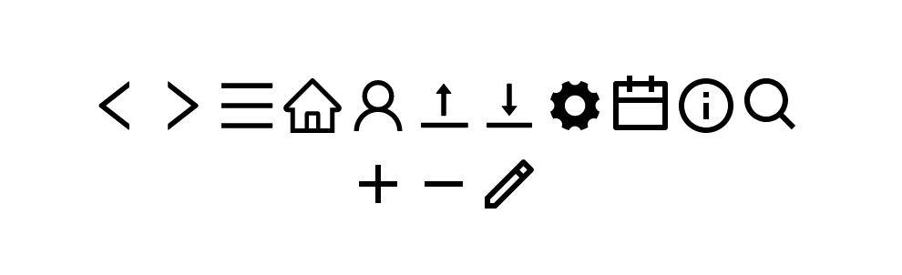
</p>

<h4>Usage:</h4>

```javascript
<IconButton icon="back" />
<IconButton icon="forward" />
<IconButton icon="menu" />
<IconButton icon="home" />
<IconButton icon="user" />
<IconButton icon="dropoff" />
<IconButton icon="pickup" />
<IconButton icon="settings" />
<IconButton icon="calendar" />
<IconButton icon="info" />
<IconButton icon="search" />
<IconButton icon="pluss" />
<IconButton icon="minus" />
<IconButton icon="edit" />
```
<a href="https://github.com/ottery-app/oui/blob/main/buttons/IconButton.js">See source code for more details</a>

<hr></hr>

<h3>ImageButton</h3>
<p>
The ImageButton component allows the user to create buttons with built in image alignment (which is pretty nifty). It has three states that it can be in: 
<ol>
<li> default </li>
<li> selected </li>
<li> error </li>
</ol>
These will change the styling of the buttons. Additionally you also have access to all the default icons saved in <a href= "#Image">Image</a>. It is important to note that this can also use custom images.
</p>

<p align="center">
    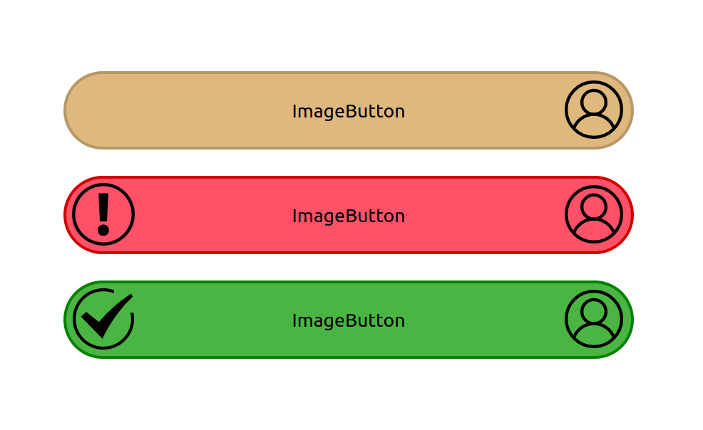
</p>

<h4>Usage:</h4>

```javascript
<ImageButton 
    content={"ImageButton"}
    right={"pfp"}
/>
<br></br>
<ImageButton 
    content={"ImageButton"}
    right={"pfp"}
    state={"error"}
/>
<br></br>
<ImageButton 
    content={"ImageButton"}
    right={"pfp"}
    state={"success"}
/>
```
<a href="https://github.com/ottery-app/oui/blob/main/buttons/ImageButton.js">See source code for more details</a>

<hr></hr>

<h3>SelectionButton</h3>
<p>
The SelectionButton component is used in tandem with a list of items. As items get selected, its number increases through the val field. The button can be pressed by the user when they have the number of elements selected that they desire. It has two other states it can be in
<ol>
<li> error </li>
<li> success </li>
</ol>
</p>

<p align="center">
    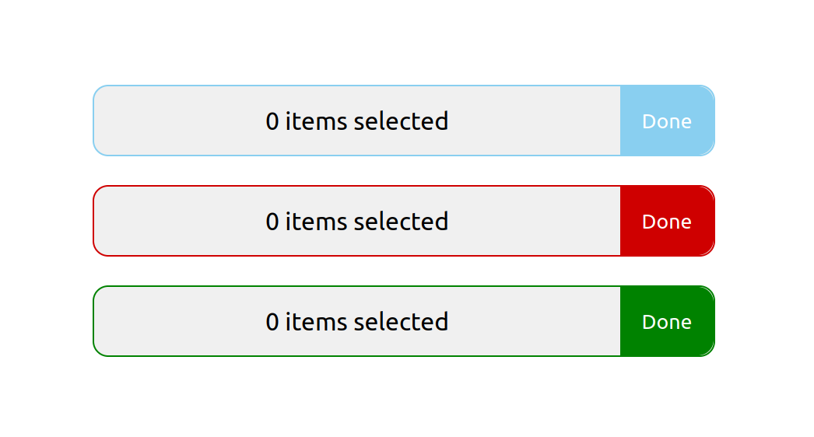
</p>

<h4>Usage:</h4>

```javascript
<SelectionButton/>
<br></br>
<SelectionButton state="error"/>
<br></br>
<SelectionButton state="success"/>
```
<a href="https://github.com/ottery-app/oui/blob/main/buttons/SelectionButton.js">See source code for more details</a>

<hr></hr>

<h3>TabButtons</h3>
<p>
The TabButton component is for buttons that are in a line. They work the same was that the tabs on your browser work, but are in fact modeled after radio buttons (in the sense that you can only have one selected at a time). They are used to toggle between views and pages. It is important to note that the children of this element are the ones that should have the onClick (not the tabBar).
</p>

<p align="center">
    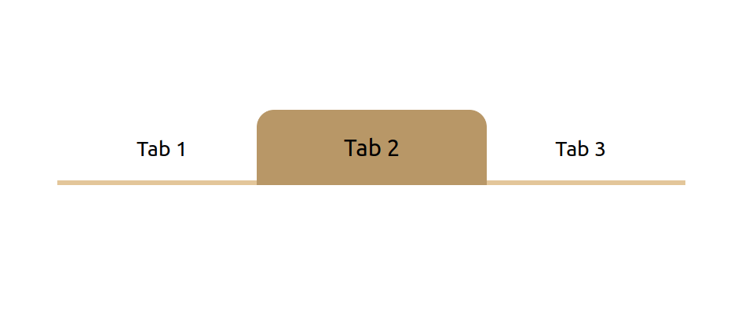
</p>

<h4>Usage:</h4>

```javascript
<TabButtons>
    <div onClick={click}>Tab 1</div>
    <div onClick={click}>Tab 2</div>
    <div onClick={click}>Tab 3</div>
</TabButtons>
```
<a href="https://github.com/ottery-app/oui/blob/main/buttons/TabButtons.js">See source code for more details</a>

# Footers

<h3>NavBar</h3>
<p>
The NavBar is designed for use on phone applications at the bottom of the screen. It takes the children passed into the component and displays them in the nav bar style. All items in the nav are displaced evenly, regardless of how many elements there are in it.
</p>

<p align="center">
    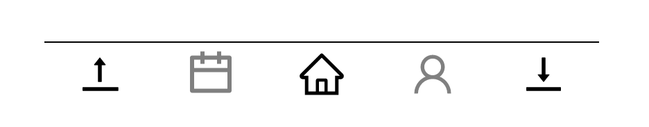
</p>

<h4>Usage:</h4>

```javascript
<NavBar>
    <IconButton icon={"dropoff"} onClick={()=>{console.log("action 1")}} />
    <IconButton icon={"calendar"} primaryTextColor={"gray"} onClick={()=>{console.log("action 2")}}/>
    <IconButton icon={"home"} onClick={()=>{console.log("action 3")}}/>
    <IconButton icon={"user"} primaryTextColor={"gray"} onClick={()=>{console.log("action 4")}}/>
    <IconButton icon={"pickup"} onClick={()=>{console.log("action 5")}}/>
</NavBar>
<br></br>
<NavBar>
    <IconButton icon={"dropoff"} onClick={()=>{console.log("action 1")}} />
    <IconButton icon={"home"} onClick={()=>{console.log("action 3")}}/>
    <IconButton icon={"pickup"} onClick={()=>{console.log("action 5")}}/>
</NavBar>
```
<a href="https://github.com/ottery-app/oui/blob/main/footers/NavBar.js">See source code for more details</a>

# Images

<h3>Image</h3>
<p>
This is the same as a regular image tag, however it has a few extra features. First, it allows the user access to default images. Second, it throws warnings when best practices are not followed.
</p>

<p align="center">
    
</p>

<h4>Usage:</h4>

```javascript
<Image src="gear" alt="gear" width="100px" height="100px" />
```
<a href="https://github.com/ottery-app/oui/blob/main/images/Image.js">See source code for more details</a>

# Inputs

<h3>Info</h3>
 The inputs are unique in the fact that they all filter through one tag "<Input/>"
Input fields are already messy, so adding multiples ways to get input from the user only made it messier. As a result, we wanted to make all forms of input easy to use and similar in their application.
  
Additionally, I believe that all user input should be carefully validated to help both the user and application. In order to do so, an input prop called regex is used. When this field is passed in, the input field will change colors to success and error based on if the users input is valid according to the regex prop passed in.
  
There are a few different types of inputs:
   - Text inuts
   - Date inputs
   - Menu inputs
  
These three inputs can be used interchangeably. However. there are a few differences between them that you need to be aware of.

 <a href="https://github.com/ottery-app/oui/blob/main/input/Input.js">view the parent class source code for more details</a>

<h3>Text Input</h3>
<p>
Text inputs are used for text input fields. They behave like regular text input fields and can be handled using standard best practices.
</p>

<p align="center">
    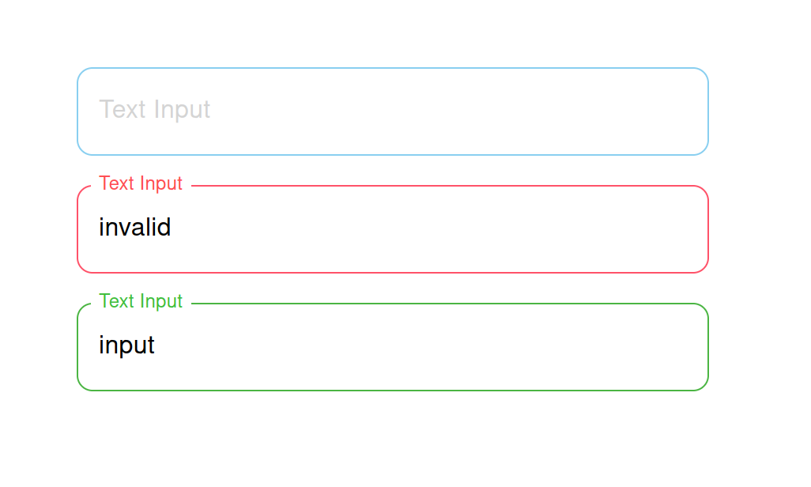
</p>

<h4>Usage:</h4>

```javascript
<Input 
    type="text"
    label="Text Input"
    regex={/regex/}
    value={val}
    onChange={(e)=>{setVal(e.target.value)}}
/>
```
<a href="https://github.com/ottery-app/oui/blob/main/input/inputs/Text.js">See source code for more details</a>

<hr></hr>

<h3>Password Input</h3>
<p>
Password inputs are just text inputs that hide the user input. They behave like regular text input fields and can be handled using standard best practices.
</p>

<p align="center">
    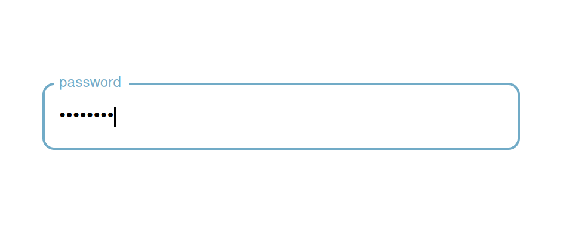
</p>

<h4>Usage:</h4>

```javascript
<Input 
    type="passwod"
    label="password"
    value={val}
    onChange={(e)=>{setVal(e.target.value)}}
/>
```
<a href="https://github.com/ottery-app/oui/blob/main/input/inputs/Text.js">See source code for more details</a>

<hr></hr>

<h3>Date Input</h3>
<p>
Date inputs are used for date input fields. They are used to get a date from the user. The date is saved in the format yyyy-mm-dd.
</p>

<p align="center">
    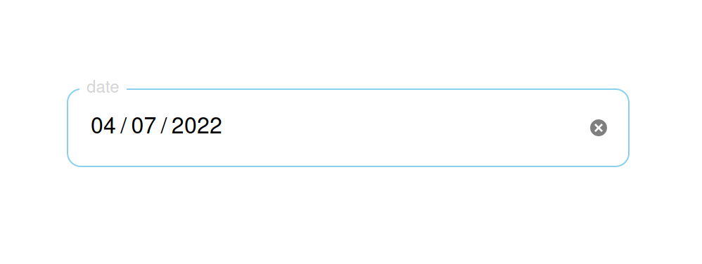
</p>

<h4>Usage:</h4>

```javascript
<Input type="date" label="date" value={val} onChange={(e)=>{setVal(e.target.value)}}/>
```
<a href="https://github.com/ottery-app/oui/blob/main/input/inputs/Date.js">See source code for more details</a>

<hr></hr>

<h3>Menu Input</h3>
<p>
Description - WIP
</p>

<p align="center">
    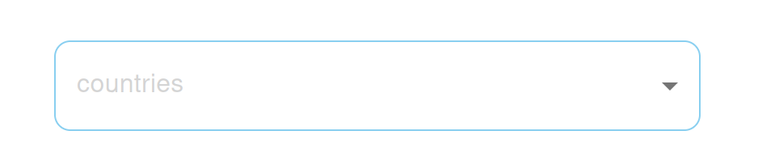
</p>

<h4>Usage:</h4>

```javascript
<Input 
    type="countries"
    label="countries"
    value={countries}
    onChange={(e)=>{setCountries(e.target.value)}}
/>
<Input 
    type="countries"
    label="supported countries"
    value={countries}
    onChange={(e)=>{setCountries(e.target.value)}}
    supported
/>
<Input 
    type="states"
    label="states"
    value={states}
    onChange={(e)=>{setStates(e.target.value)}}
/>
<Input 
    type="states"
    label="supported states"
    value={states}
    onChange={(e)=>{setStates(e.target.value)}}
    supported
/>
<Input 
    type="menu"
    label="custom"
    value={custom}
    onChange={(e)=>{setCustom(e.target.value)}}
    fields={["field1", "field2"]}
/>
```
<a href="https://github.com/ottery-app/oui/blob/main/input/inputs/Menu.js">See source code for more details</a>

# Lists

<h3>OrderedList</h3>
<p>
OrderedList is used to display a list of items in a container while providing an optional way to add new items. Additionally it accepts a function which is used to sort the children. If the onClick is excluded the option to add new items is not available.
</p>

<p align="center">
    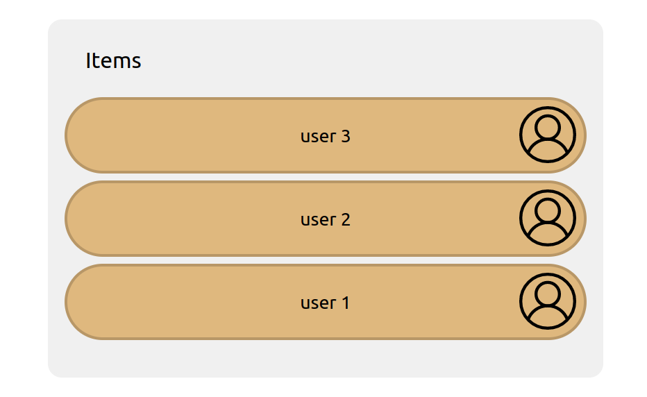
</p>

<h4>Usage:</h4>

```javascript
<OrderedList sort={(a,b)=>{
        return (a.props.key < a.props.key) ? -1 : 1;
      }}>
    <ImageButton key={1} content={"user 1"} right="pfp"/>
    <ImageButton key={2} content={"user 2"} right="pfp"/>
    <ImageButton key={3} content={"user 3"} right="pfp"/>
</OrderedList>
```
<a href="https://github.com/ottery-app/oui/blob/main/lists/OrderedList.js">See source code for more details</a>

<hr></hr>

<h3>UnorderedList</h3>
<p>
UnorderedList is used to display a list of items in a container while providing an optional way to add new items. If the onClick is excluded the option to add new items is not available.
</p>

<p align="center">
    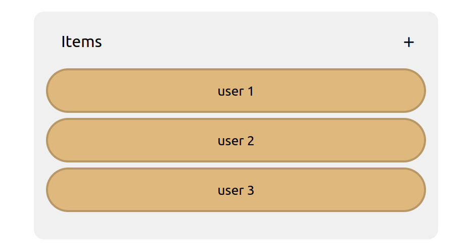
</p>

<h4>Usage:</h4>

```javascript
<UnorderedList onClick={()=>{}}>
    <ImageButton content={"user 1"} right="pfp"/>
    <ImageButton content={"user 2"} right="pfp"/>
    <ImageButton content={"user 3"} right="pfp"/>
</UnorderedList>
```
<a href="https://github.com/ottery-app/oui/blob/main/lists/UnorderedList.js">See source code for more details</a>

# Progress Bars

<h3>StepBar</h3>
<p>
The StepBar component is designed to be used in multifield forms allowing quick on click access to a page of  the form an clear denotation of your location in the form.
</p>

<p align="center">
    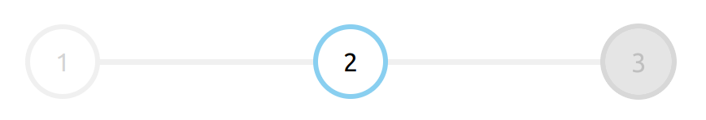
</p>

<h4>Usage:</h4>

```javascript
<StepBar numFields={3} current={val} onClick={(val)=>{setVal(val)}} />
```
<a href="https://github.com/ottery-app/oui/blob/main/progressBars/stepBar.js">See source code for more details</a>

# Styles

OUI takes advantage of the use of global values to quickly make elements follow the desired global theme. Below is a description of each set of values, what they do, and where they can be found.


<h3>Colors</h3>
<p>
These are the colors that are used to define the default values for the source code. They can be modified in order to have a more custom usage of OUI.
</p>
<a href="https://github.com/ottery-app/oui/blob/main/styles/colors.js">See source code for more details</a>


<hr></hr>

<h3>Clickable</h3>
<p>
These are the variables that are used for clickable objects. This UI was designed for web applications, and so the sizes for clickable objects are scaled for that. If you wanted to switch to a PC-based website, you could edit that here.
</p>
<a href="https://github.com/ottery-app/oui/blob/main/styles/clickable.js">See source code for more details</a>


<hr></hr>

<h3>Banners</h3>
<p>
These are used for handling the sizes of banners such as the header.
</p>
<a href="https://github.com/ottery-app/oui/blob/main/styles/banners.js">See source code for more details</a>

<hr></hr>

<h3>Image</h3>
<p>
Here you can find the standards for the different types of images that you can have.
</p>
<a href="https://github.com/ottery-app/oui/blob/main/styles/image.js">See source code for more details</a>


<hr></hr>

<h3>Radius</h3>
<p>
These are the different types of radi that can be used in the web app. If you wanted to switch to a more square shaped vibe you could change the variables in here.
</p>
<a href="https://github.com/ottery-app/oui/blob/main/styles/radius.js">See source code for more details</a>
