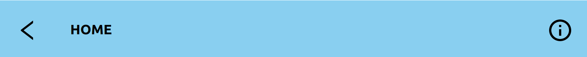
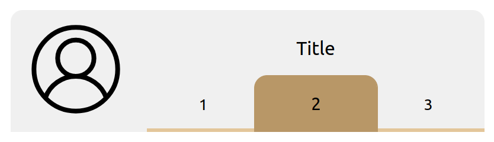
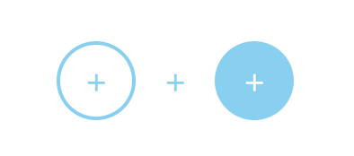
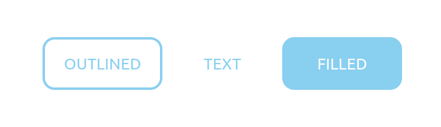

# ottery-ui
<p>
This is a react based ui framework following the ottery design schema. The objective of this software is to provide a simple and easy to use react library that is used by ottery and others who like it.
</p>

<p>
We felt that it was best that oui was not published or used through npm but instead manually added to a project. The reasoning behind this was that we wanted the code to be easily modifiable for your specific needs. For example. You can easily change the basic color theme by going into oui/styles/colors rather then having to deal with pesky and confusing api (yuck). Heck you can even replace a component entirely or switch the way it functions.
</p>

# getting started
Copy the file into your src folder in a react app and access components either from oui/index.js or directly from their own files. To run the app you need to make sure that you have some dependancies installed. They can be quickly installed using the following code:

```shell
npm config set legacy-peer-deps true
npm install react --save-dev
npm install react-dom --save-dev
npm install styled-components --save-dev
npm install react-icons --save-dev
npm install @mui/material @emotion/react @emotion/styled --save-dev
npm install @material-ui/styles --save-dev
npm install axios --save-dev
npm install --save-dev @babel/core @babel/cli @babel/preset-env npm install -save @babel/polyfill
npm install @material-ui/core --save-dev
```
Possible issues:
1. make sure you have no node modules installed in oui. These should be in your main aplication.

# Components
<p>
All components are handled based on their global styles. These can be found in oui/styles. They are a list of const exports that are used in the generation of the styled react. <a href="#styles">These</a> can be edited at the users leasure in order to make a more stylized ui.
</p>
<p>
components can be imported in two different ways. The first is through accessing the index.js exports or by going directly to the component root. Both do the same thing. However it's always nice to know the options :)
</p>

For example:
```javascript
import { MultiFieldHeader } from "{relativePath}/oui/index";
//or
import MultiFieldHeader from "{relativePath}/oui/headers/MainHeader";
```

# headers
<h3>MainHeader</h3>
<p>
The MainHeader component is the main header of the application. It is used as a banner
that spreads from left to right. It however on its own does not spread itself forcefully to the top of the page.
It needs to be put in a container that does so or directly modified to do so using the class name oui-main-header
or attaching an id or class name as a property.
</p>



<h4>Usage:</h4>

```javascript
<MainHeader
    left={<IconButton icon="back" />}
    main={<h3>HOME</h3>}
    right={<IconButton icon="info" />}
/>
```
<a href="">See source code for more details</a>

<hr></hr>

<h3>MultiFieldHeader</h3>
<p>
This is the MultiFieldHeader component. It allows for a header with mutiple fields
through the use of a key callback.
It also includes an edit button that can be called using the onEdit callback.
This header will fill to fit the width of the parent container. This can be changed by editing the className.
oui-multi-field-header or by passing in a class name or id.
</p>

<p align="center">
    
</p>

<h4>Usage:</h4>

```javascript
<MultiFieldHeader
    title="Title"
    src="pfp"
    onTab={(key)=>{/*change a value based on key*/}}
>
    <span key="1">1</span>
    <span key="2">2</span>
    <span key="3">3</span>
</MultiFieldHeader>
```
<a href="">See source code for more details</a>

# buttons

<h3>AddButton</h3>
<p>
This is the AddButton component. It is a button with an onClick callback and looks like a generic add sign.
It has three states that it is able to be in filled (default), outline, and text.
</p>

<p align="center">

</p>

<h4>Usage:</h4>

```javascript
<AddButton type="outline" />
<AddButton type="text" />
<AddButton type="filled" />
```
<a href="">See source code for more details</a>

<hr><hr/>

<h3>Button</h3>
<p>
This is the Button component. It is a button with an onClick callback.
It has three states that it is able to be in filled (default), outline, and text.
</p>

<p align="center">
    
</p>

<h4>Usage:</h4>

```javascript
<Button type="outline">outlined</Button>
<Button type="text">text</Button>
<Button type="filled">filled</Button>
```
<a>See source code for more details</a>

<hr></hr>

<h3>IconButton</h3>
<p>
Description
</p>

<p align="center">
    
</p>

<h4>Usage:</h4>

```javascript
code
```
<a>See source code for more details</a>

<hr></hr>

<h3>ImageButton</h3>
<p>
Description
</p>

<p align="center">
    
</p>

<h4>Usage:</h4>

```javascript
code
```
<a>See source code for more details</a>

<hr></hr>

<h3>ImageButton</h3>
<p>
Description
</p>

<p align="center">
    
</p>

<h4>Usage:</h4>

```javascript
code
```
<a>See source code for more details</a>

<hr></hr>

<h3>SelectionButton</h3>
<p>
Description
</p>

<p align="center">
    
</p>

<h4>Usage:</h4>

```javascript
code
```
<a>See source code for more details</a>

<hr></hr>

<h3>TabButtons</h3>
<p>
Description
</p>

<p align="center">
    
</p>

<h4>Usage:</h4>

```javascript
code
```
<a>See source code for more details</a>

# footers

<h3>NavBar</h3>
<p>
Description
</p>

<p align="center">
    
</p>

<h4>Usage:</h4>

```javascript
code
```
<a>See source code for more details</a>

# images

<h3>Image</h3>
<p>
Description
</p>

<p align="center">
    
</p>

<h4>Usage:</h4>

```javascript
code
```
<a>See source code for more details</a>

# inputs

<h3>Text Input</h3>
<p>
Description
</p>

<p align="center">
    
</p>

<h4>Usage:</h4>

```javascript
code
```
<a>See source code for more details</a>

<hr></hr>

<h3>Password Input</h3>
<p>
Description
</p>

<p align="center">
    
</p>

<h4>Usage:</h4>

```javascript
code
```
<a>See source code for more details</a>

<hr></hr>

<h3>Date Input</h3>
<p>
Description
</p>

<p align="center">
    
</p>

<h4>Usage:</h4>

```javascript
code
```
<a>See source code for more details</a>

<hr></hr>

<h3>Menu Input</h3>
<p>
Description
</p>

<p align="center">
    
</p>

<h4>Usage:</h4>

```javascript
code
```
<a>See source code for more details</a>

# lists

<h3>OrderedList</h3>
<p>
Description
</p>

<p align="center">
    
</p>

<h4>Usage:</h4>

```javascript
code
```
<a>See source code for more details</a>

<hr></hr>

<h3>UnorderedList</h3>
<p>
Description
</p>

<p align="center">
    
</p>

<h4>Usage:</h4>

```javascript
code
```
<a>See source code for more details</a>

# progressBars

<h3>StepBar</h3>
<p>
Description
</p>

<p align="center">
    
</p>

<h4>Usage:</h4>

```javascript
code
```
<a>See source code for more details</a>

# styles

<h3>Colors</h3>
<p>
Description
</p>
<a>See source code for more details</a>


<hr></hr>

<h3>Clickable</h3>
<p>
Description
</p>
<a>See source code for more details</a>


<hr></hr>

<h3>banners</h3>
<p>
Description
</p>
<a>See source code for more details</a>

<hr></hr>

<h3>image</h3>
<p>
Description
</p>
<a>See source code for more details</a>


<hr></hr>

<h3>radius</h3>
<p>
Description
</p>
<a>See source code for more details</a>